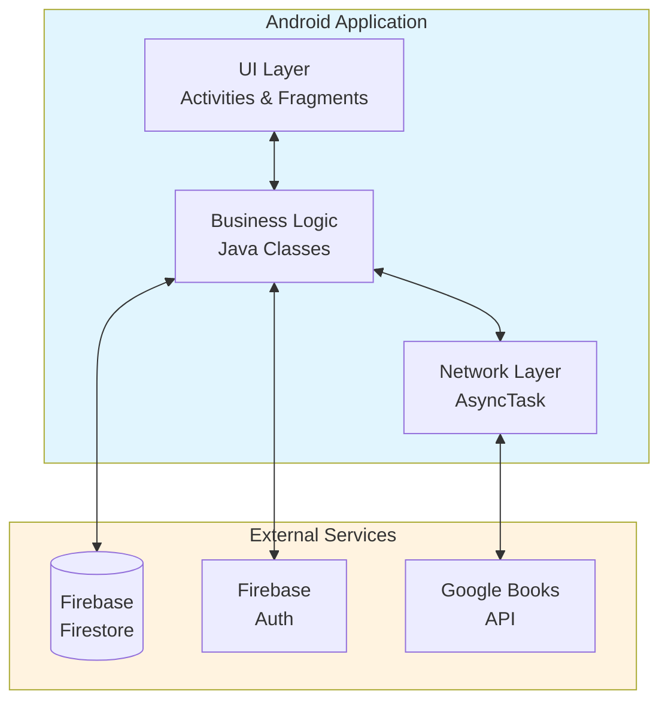
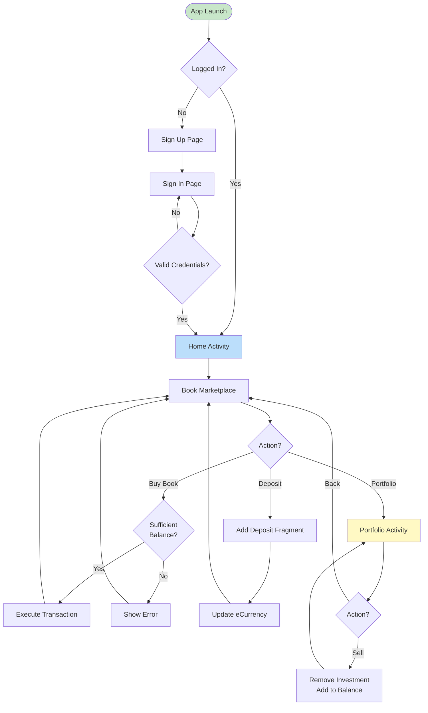
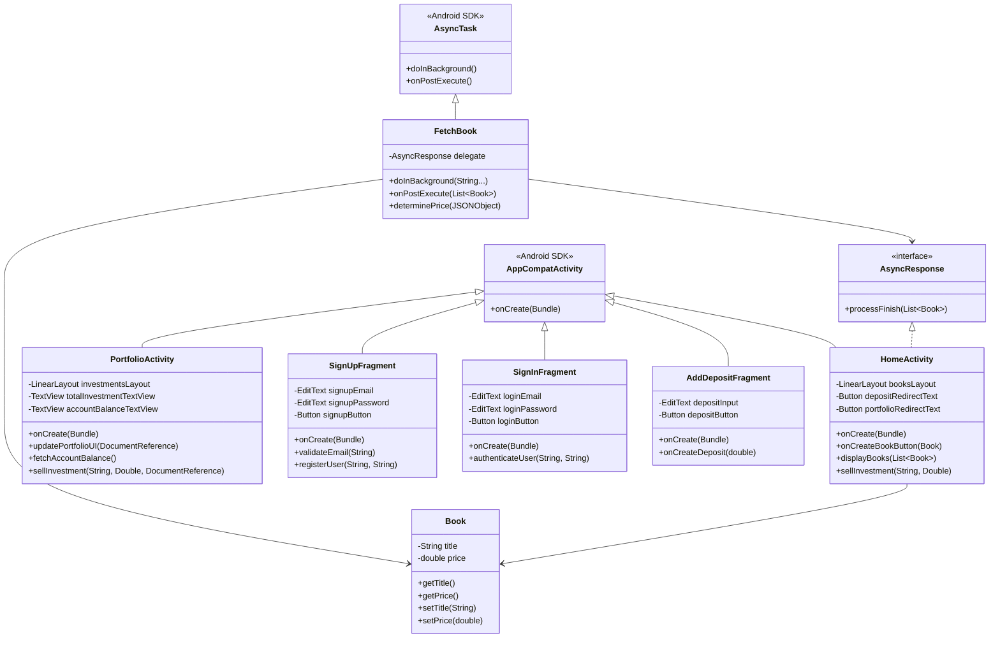
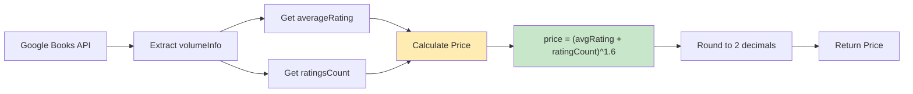
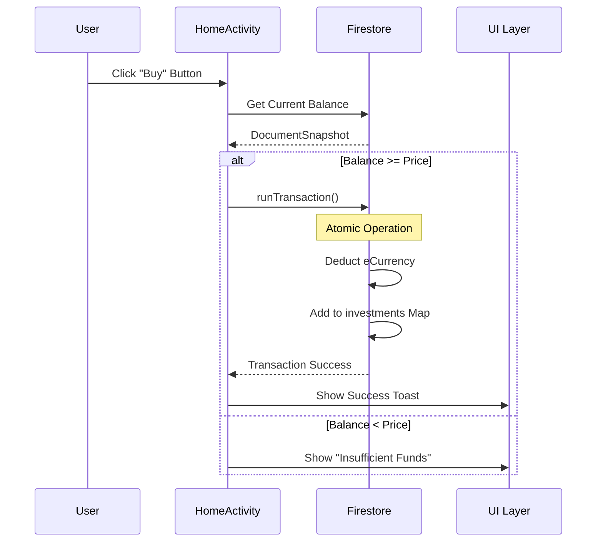
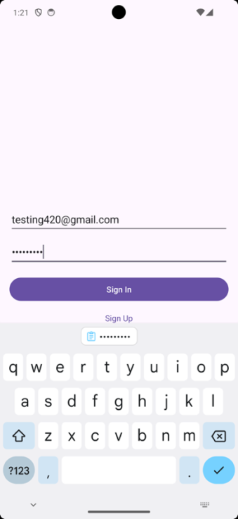
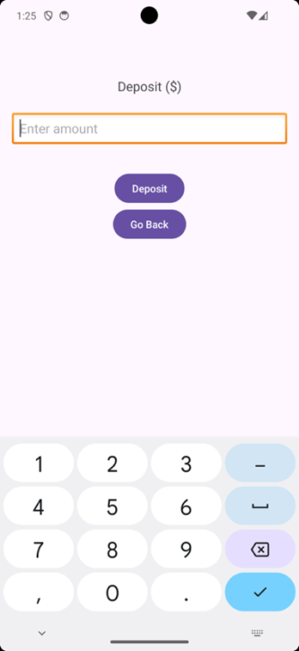
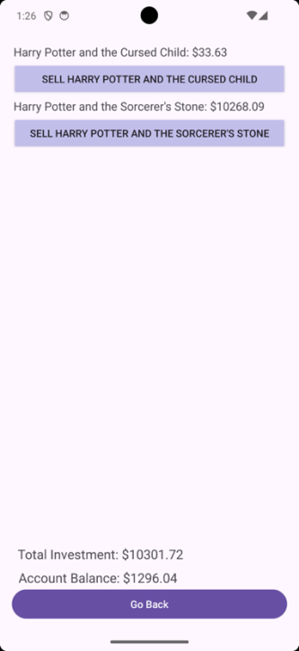
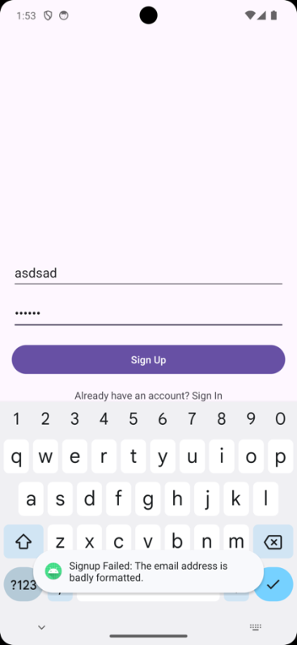
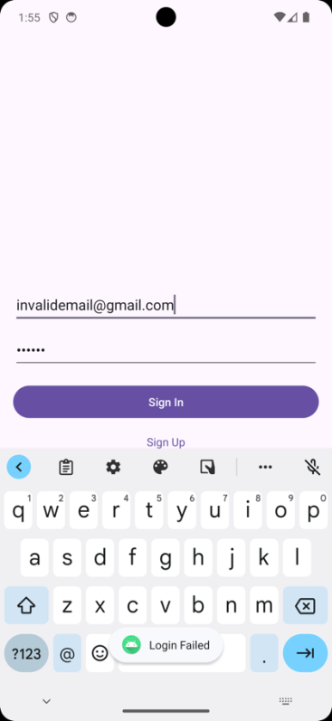

<div align="center">

# PageFund

### A Book Investment Simulator for Android

[](https://www.java.com/)
[](https://developer.android.com/)
[](https://firebase.google.com/)
[](https://developers.google.com/books)

**IB Computer Science HL Internal Assessment**

*An Android application that enables users to invest virtual currency in books, with prices dynamically calculated from real-world popularity metrics.*

[Features](#features) • [Tech Stack](#tech-stack) • [Architecture](#architecture) • [Installation](#installation) • [Documentation](#documentation)

</div>

---

## Project Overview

| | |
|---|---|
| **Developer** | Rohan Muppa |
| **Client** | Timothy Edward Gray |
| **Advisor** | Sandesh Tilapudi (15+ years in Java Android Development) |
| **Platform** | Android (API 31+) |
| **Development Period** | February - March 2024 |
| **Total Development Hours** | 72.5 hours |

---

## The Problem

My client, Timothy Edward Gray, is an avid enthusiast who has made harmless wagers on pop culture phenomena for years but has never found a way to apply this passion in a tangible, measurable manner. He expressed a desire for a platform where he could "invest" in upcoming books and track his predictions.

> **Main Takeaway:** Client is gifted in the art of predicting but has not found a way to gamify this. There is an absence of a competitive, measurable way to gauge and reward accurate predictions in the realm of literature success.

---

## The Solution

**PageFund** is an Android mobile application that enables users to "purchase" shares in books using virtual currency. The platform simulates a real market by:

- Fetching real-time book data from the **Google Books API**
- Calculating dynamic prices based on **average ratings** and **rating counts**
- Providing a complete investment ecosystem with **buying**, **selling**, and **portfolio management**
- Ensuring data integrity through **Firebase atomic transactions**

---

## Features

| Feature | Description | Priority |
|---------|-------------|----------|
| **User Authentication** | Secure sign-up/sign-in with email validation and 8+ character passwords | High |
| **Book Marketplace** | Browse books with real-time prices fetched from Google Books API | High |
| **Investment Engine** | Buy books with virtual currency; validates sufficient balance before transactions | High |
| **Dynamic Valuation** | Prices update based on real-world book popularity metrics | High |
| **Currency Deposits** | Add any amount of virtual currency to your account | Medium |
| **Portfolio Dashboard** | View all investments, total value, and current balance; sell investments | Medium |
| **Session Management** | Auto-logout on app close for security | Low |

---

## Tech Stack

| Category | Technology |
|----------|------------|
| **Language** | Java |
| **Platform** | Android (Native) |
| **IDE** | Android Studio |
| **Database** | Firebase Cloud Firestore |
| **Authentication** | Firebase Authentication |
| **External API** | Google Books API v1 |
| **Networking** | HttpURLConnection + AsyncTask |
| **UI Framework** | Android XML Layouts |

---

## Architecture

### System Overview



### User Flow



### Class Diagram



### Valuation Algorithm



**Formula:** `price = Math.pow((averageRating + ratingCount), 1.6)`

This algorithm combines:
- **Quality Signal:** Average rating (1-5 scale)
- **Engagement Signal:** Total number of ratings
- **Exponential Growth:** The 1.6 exponent rewards highly-rated, popular books

### Data Flow: Investment Transaction



---

## Project Structure

```
PageFund/
├── Product/
│   ├── App.java                    # Firebase initialization
│   ├── MainActivity.java           # App entry point
│   ├── SignUpFragment.java         # User registration
│   ├── SignInFragment.java         # User authentication
│   ├── HomeActivity.java           # Book marketplace + buying
│   ├── PortfolioActivity.java      # Investment dashboard + selling
│   ├── AddDepositFragment.java     # Virtual currency deposits
│   ├── Book.java                   # Book data model (encapsulation)
│   ├── FetchBook.java              # AsyncTask for API calls
│   └── XMLs/
│       ├── AndroidManifest.xml     # App configuration
│       ├── layout/                 # UI layouts
│       │   ├── activity_main.xml
│       │   ├── activity_home.xml
│       │   ├── activity_portfolio.xml
│       │   ├── fragment_sign_up.xml
│       │   ├── fragment_sign_in.xml
│       │   └── fragment_add_deposit.xml
│       ├── values/
│       │   ├── colors.xml
│       │   ├── strings.xml
│       │   └── themes.xml
│       └── navigation/
│           └── nav_graph.xml
│
├── Documentation/
│   ├── Crit_A_Planning.pdf
│   ├── Crit_B_Design.pdf
│   ├── Crit_B_Record_of_Tasks.pdf
│   ├── Crit_C_Development.pdf
│   ├── Crit_E_Evaluation.pdf
│   └── Appendix.pdf
│
├── fullDocumentation.pdf           # Complete IA documentation
└── README.md
```

---

## HL Complexity Techniques

### 1. Object-Oriented Programming

| Technique | Implementation |
|-----------|----------------|
| **Encapsulation** | `Book` class with private fields and public getters/setters |
| **Inheritance** | All Activities extend `AppCompatActivity` |
| **Polymorphism** | `FetchBook` extends `AsyncTask` for async execution |
| **Interface Implementation** | `HomeActivity` implements `AsyncResponse` callback |

### 2. Data Structures

| Structure | Usage |
|-----------|-------|
| `HashMap<String, Object>` | Storing user investments in Firestore |
| `ArrayList<Book>` | Holding books fetched from API |
| `JSONObject` / `JSONArray` | Parsing Google Books API responses |
| `Map<String, Double>` | Portfolio tracking with title-price pairs |

### 3. Algorithms

- **Valuation Algorithm:** Exponential calculation combining ratings and popularity
- **Transaction Validation:** Balance checking before investment execution
- **JSON Parsing:** Recursive iteration through nested API response structure
- **Data Filtering:** Skipping books with incomplete rating data

### 4. Advanced Techniques

| Technique | Description |
|-----------|-------------|
| **Atomic Transactions** | Firestore `runTransaction()` for ACID-compliant updates |
| **Asynchronous Programming** | `AsyncTask` for non-blocking network calls |
| **Callback Pattern** | `AsyncResponse` interface for thread communication |
| **Document Snapshots** | Real-time data consistency in Firebase |

---

## Success Criteria

| # | Criteria | Priority | Status |
|---|----------|----------|--------|
| 1 | Users must be able to create an account with a valid email and password (8+ characters) | High | Achieved |
| 2 | Users must be able to browse through different books on the marketplace | High | Achieved |
| 3 | System must allow investments but validate sufficient virtual currency | High | Achieved |
| 4 | App must update investment values with data from verified APIs every instance | High | Achieved |
| 5 | App should allow users to add any amount of currency to their account | Medium | Achieved |
| 6 | App should allow users to view/manage investments and see current balance | Medium | Achieved |
| 7 | System should log user off when application closes | Low | Achieved |

---

## Screenshots

### Authentication Flow

| Sign Up | Sign In |
|:-------:|:-------:|
|  |  |
| *User registration with email/password validation* | *Secure login with credential validation* |

### Main Application

| Marketplace | Deposit | Portfolio |
|:-----------:|:-------:|:---------:|
|  |  |  |
| *Browse books with live prices* | *Add virtual currency* | *View & manage investments* |

### Error Handling

| Invalid Email | Login Failed |
|:-------------:|:------------:|
|  |  |
| *Email validation error on signup* | *Authentication failure notification* |

---

## Firestore Data Schema

```
/users/{uid}
├── email: string
├── eCurrency: double
├── createdAt: timestamp
└── investments: Map<String, Double>
    ├── "Harry Potter and the Cursed Child": 33.63
    ├── "Harry Potter and the Sorcerer's Stone": 10268.09
    └── ...
```

---

## Installation

<details>
<summary><b>Prerequisites</b></summary>

- Android Studio (Arctic Fox or later)
- JDK 11 or higher
- Android SDK (API Level 31+)
- Firebase account with Firestore and Authentication enabled

</details>

<details>
<summary><b>Setup Instructions</b></summary>

1. **Clone the repository**
   ```bash
   git clone https://github.com/yourusername/PageFund.git
   cd PageFund
   ```

2. **Open in Android Studio**
   - Launch Android Studio
   - Select "Open an Existing Project"
   - Navigate to the cloned directory

3. **Configure Firebase**
   - Create a new Firebase project at [console.firebase.google.com](https://console.firebase.google.com)
   - Enable **Email/Password Authentication**
   - Create a **Cloud Firestore** database
   - Download `google-services.json` and place it in the `app/` directory

4. **Build and Run**
   ```bash
   ./gradlew assembleDebug
   ```
   Or use Android Studio's Run button with an emulator or physical device.

</details>

---

## Usage

```
┌─────────────────────────────────────────────────────────────┐
│                      PageFund - Quick Start                 │
├─────────────────────────────────────────────────────────────┤
│                                                             │
│  1. REGISTER     Create account with email + password       │
│                  (minimum 8 characters)                     │
│                                                             │
│  2. DEPOSIT      Add virtual currency to your account       │
│                  Navigate: Home → "Deposit Money"           │
│                                                             │
│  3. BROWSE       View available books with live prices      │
│                  Prices based on Google Books API data      │
│                                                             │
│  4. INVEST       Click "BUY" on any book                    │
│                  Transaction validates your balance         │
│                                                             │
│  5. MANAGE       View portfolio: Home → "Go to Portfolio"   │
│                  Sell investments to reclaim currency       │
│                                                             │
└─────────────────────────────────────────────────────────────┘
```

---

## Code Examples

### Valuation Algorithm

```java
public double determinePrice(JSONObject volumeInfo) {
    double averageRating = volumeInfo.optDouble("averageRating");
    int ratingCount = volumeInfo.optInt("ratingsCount");

    // Perform the calculation
    double calculatedPrice = Math.pow((averageRating + ratingCount), 1.6);

    // Round to 2 decimal places
    BigDecimal price = BigDecimal.valueOf(calculatedPrice);
    price = price.setScale(2, RoundingMode.HALF_UP);

    return price.doubleValue();
}
```

### Firebase Transaction (Atomic Buy Operation)

```java
db.runTransaction(transaction -> {
    DocumentSnapshot snapshot = transaction.get(userRef);
    Double currentBalance = snapshot.getDouble("eCurrency");

    if (currentBalance != null && currentBalance >= price) {
        // Atomic update: deduct balance and add investment
        transaction.update(userRef, "eCurrency", currentBalance - price);

        Map<String, Object> investments = (Map<String, Object>) snapshot.get("investments");
        if (investments == null) investments = new HashMap<>();
        investments.put(bookTitle, price);

        transaction.update(userRef, "investments", investments);
    }
    return null;
}).addOnSuccessListener(aVoid -> {
    Toast.makeText(this, "Investment successful!", Toast.LENGTH_SHORT).show();
});
```

### AsyncTask for API Calls

```java
public class FetchBook extends AsyncTask<String, Void, List<Book>> {

    private AsyncResponse delegate = null;

    public interface AsyncResponse {
        void processFinish(List<Book> output);
    }

    @Override
    protected List<Book> doInBackground(String... params) {
        // HTTP GET request to Google Books API
        URL url = new URL(params[0]);
        HttpURLConnection urlConnection = (HttpURLConnection) url.openConnection();
        urlConnection.setRequestMethod("GET");

        // Parse JSON response
        JSONObject jsonObject = new JSONObject(builder.toString());
        JSONArray itemsArray = jsonObject.getJSONArray("items");

        // Extract book data and calculate prices
        for (int i = 0; i < count; i++) {
            JSONObject book = itemsArray.getJSONObject(i);
            JSONObject volumeInfo = book.getJSONObject("volumeInfo");

            String title = volumeInfo.optString("title", "No Title");
            double price = determinePrice(volumeInfo);
            result.add(new Book(title, price));
        }
        return result;
    }

    @Override
    protected void onPostExecute(List<Book> books) {
        delegate.processFinish(books);
    }
}
```

---

## Documentation

| Document | Description |
|----------|-------------|
| [Criterion A: Planning](./Documentation/Crit_A_Planning.pdf) | Problem definition, rationale, success criteria |
| [Criterion B: Design](./Documentation/Crit_B_Design.pdf) | Flowcharts, UML diagrams, UI mockups |
| [Criterion B: Record of Tasks](./Documentation/Crit_B_Record_of_Tasks.pdf) | Development timeline (52 tasks) |
| [Criterion C: Development](./Documentation/Crit_C_Development.pdf) | Technical implementation details |
| [Criterion E: Evaluation](./Documentation/Crit_E_Evaluation.pdf) | Success criteria evaluation, client feedback |
| [Appendix](./Documentation/Appendix.pdf) | Citations, client consultation transcripts |
| [Full Documentation](./fullDocumentation.pdf) | Complete IA document |

---

## Future Development

Based on client feedback and evaluation, planned enhancements include:

| Feature | Description | Implementation Approach |
|---------|-------------|------------------------|
| **Multiple Shares** | Buy multiple shares of a single book | Modify investments Map to include "shares" value pair |
| **Search Functionality** | Search/filter books in marketplace | Implement RecyclerView with dynamic filtering |
| **Background Sync** | Replace AsyncTask with WorkManager | Scalable background fetch operations |
| **Automated Testing** | Add test suites | Espresso/JUnit5 for auth, navigation, transactions |
| **Multilingual Support** | Localization | Resource bundles for broader accessibility |

---

## Record of Tasks Summary

| Phase | Tasks | Duration |
|-------|-------|----------|
| Planning (Criterion A) | Initial consultation, scope definition, tech stack selection | 7 hours |
| Design (Criterion B) | Database schema, UI mockups, flowcharts, UML diagrams | 15 hours |
| Development (Criterion B/C) | Authentication, marketplace, portfolio, transactions | 42 hours |
| Testing | Manual testing, success criteria validation | 5.5 hours |
| Evaluation (Criterion E) | Client feedback, documentation | 3 hours |
| **Total** | **52 tasks** | **72.5 hours** |

---

## Acknowledgments

- **Timothy Edward Gray** - Client, for the project vision and feedback
- **Sandesh Tilapudi** - Advisor, for technical guidance on Android development
- **Google Books API** - For providing real-time book metadata
- **Firebase** - For authentication and database infrastructure

---

## References

- "Firebase Authentication." Firebase Documentation, Google.
- "Firebase Realtime Database." Firebase Documentation, Google.
- "Google Books APIs." Google Developers, Google.
- Morrison, Michael. *Head First Android Development*. 2nd ed., O'Reilly Media, 2017.
- Phillips, Bill, et al. *Android Programming: The Big Nerd Ranch Guide*. 4th ed., Big Nerd Ranch Guides, 2019.
- Neilsen, Jakob. "Usability 101: Introduction to Usability." Nielsen Norman Group, 2012.
- Leach, Jim. "Developing Secure Mobile Applications for Android." OWASP, 2015.

---

<div align="center">

**PageFund** - IB Computer Science HL Internal Assessment

Developed by Rohan Muppa

[](https://linkedin.com/in/rohanmuppa)

</div>
